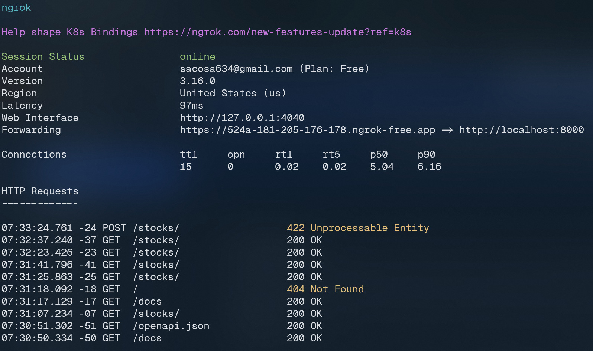
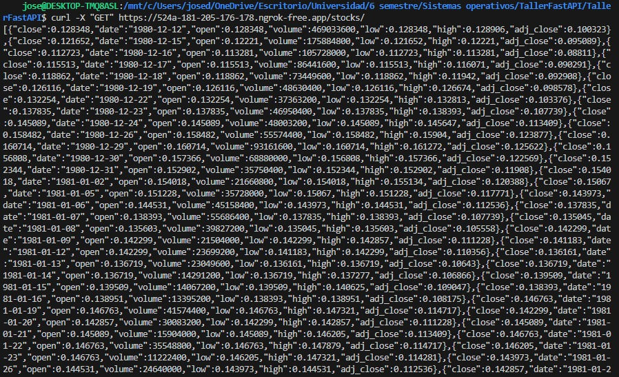

# Taller Sistemas Operativos

## Implementación del servidor con Ngrok:

### Tabla de las peticiones recibidas por el servidor en la URL de Ngrok:

- En la tabla de peticiones se especifica la localización del servidor, la versión de Ngrok y la cuenta asociada.

### Respuesta a una peticion realizada desde un cliente a la URL:

- Para comprobar el correcto funcionamiento del servidor, realizamos una petición mediante cURL desde un cliente distinto.

